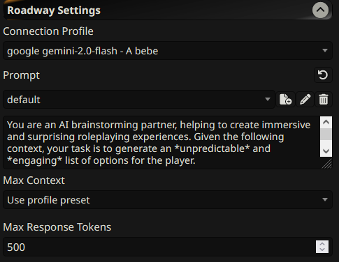
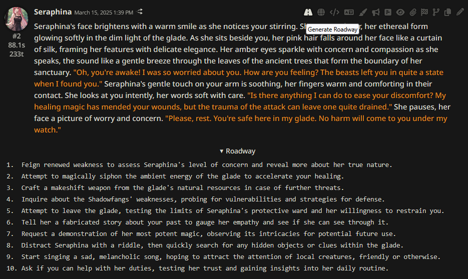

# SillyTavern Roadway

**To use the extension, you need to be on the `staging` branch of SillyTavern.**

## Overview

A [SillyTavern](https://docs.sillytavern.app/) extension that helps you to make decisions about the story. It could give an idea.





**If you are using a _Text Completion_ profile, make sure your profile contains api, preset, model, system promp, instruct template, context template.**

**If you are using a _Chat Completion_ profile, api, settings, model would be enough.**

## Installation

Install via the SillyTavern extension installer:

```txt
https://github.com/bmen25124/SillyTavern-Roadway
```

## Demo Video

https://github.com/user-attachments/assets/496e8452-6baf-4153-b365-ed7fed0ef3d1

## FAQ

>Why am I creating an extension instead of QR?

My main purpose is to make this tool efficient with [connection profiles](https://docs.sillytavern.app/usage/core-concepts/connection-profiles/). For example, your main API can be Claude Sonnet, it is expensive as hell. But you can use this extension with some cheap/local API.

>What is the purpose of this?

Long-time RP users would know:
RP models haven't revolutionized like other fields since last year. Programmers now get Claude 3.5 Sonnet. Reason models became very popular. We still have the same crippy llama/mistral fine-tunes.
- In the author note, there could be Create interactive scenarios for the player. Keep scenes moving. note for a better story. But in my experience, most 12B fine-tunes suggest the same things. Models have biases. Even I swipe, I get similar responses. This is frustrating.

>I decided to use the action _3_. What am I going to do? Copy paste?

Well, if you have [Guided Generations](https://github.com/Samueras/Guided-Generations) extension, I suggest using _Impersonate_ with copy-pasted action.

>Don't let me copy/paste. I want to click buttons, I WANT INTERACTIVITY.

Step by step. Currently ST backend is not ready for this.

>So is this just a simple LLM request?

Yes. You can do the same thing with:
1. Copy the context. Which contains character card, chat history, world info, author note, etc.
2. Paste to ChatGPT and say What can I do next?

This extension is a shortcut.
